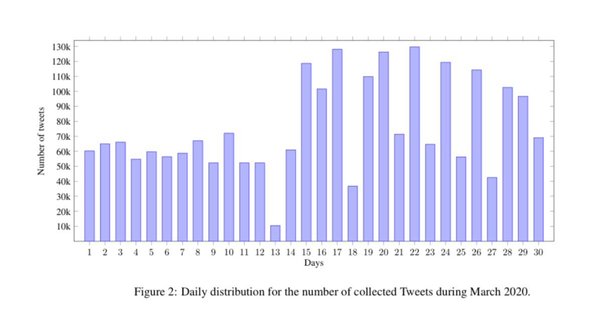

# COVID-19-Arabic-Tweets-Dataset
The repository contains a collection of Arabic tweets IDs related to novel coronavirus COVID-19. The dataset contains Tweets ids starting from  January ,2020 . The Twitter search API was used to gather real-time tweets that contained specific keywords in the Arabic language. To comply with [Twitter’s Terms of Service](https://developer.twitter.com/en/developer-terms/agreement-and-policy), only the ids of the tweets are released. This dataset is for non-commercial research use only.
# Data Organization
* As of April 19, 2020 we have tweets from January,2020 unitl April 15, 2020 tweets. We plan to add more months in upcoming days
and continuosly update this page.
*	Tweet-ID files are stored in folders that indicate the year and month of the collection
*	The Tweet-ID files contain the tweets ids, all files name have the same structure, with a prefix “COVID19-tweetID-year-month-day"
# Dataset collection
*	Only tweets in Arabic language were collected from February 1,2020 to April 15, 2020.
* The keywords.txt file contains the updated keywords along with the date we began tracing them. The Hashtags.txt files contain the hashtags that we followed in our Twitter data-set the number of tweets collected for each hashtag along with the date we began tracing them.
* Since Twitter’s search API have a restriction on the amount of the retrieved data there are missing hours of data.
* We provided preliminary statistics of the data-set in the associated paper to this repository. The preliminary statistics will be automatically updated with every update of the dataset.
* For retrieving, the full object of the tweet consider the following tools [Hydrator](https://github.com/DocNow/hydrator)  and [twarc](https://github.com/DocNow/twarc) .

# Dataset Statistics
The following statistics is from Tweets colected until April,15,2020. 
The Number of Tweets: 3,934,610  
The Number of Original Tweets : 3,934,235
The Number of  Retweets: 375
The Average  of Tweets Collected Daily : 77471  

# Guideline to Hydrate
 ### Using TWARC Notebook ### 
To hydrate the tweets-ID from our [COVID-19-Arabic-Tweets-Dataset GitHub repository](http://github.com/SarahAlqurashi/COVID-19-Arabic-Tweets-Dataset) you can use our  [Hydrate_TweetIDs_Arabic_COVID19](https://github.com/SarahAlqurashi/COVID-19-Arabic-Tweets-Dataset/blob/master/Guideline%20to%20Hydrate/Hydrate_TweetIDs_Arabic_COVID19.ipynb) notebook.

* The notebook runs on google collab 
* You are required to have a Twitter developer account

For those who prefer  to use a Graphical User Interface (GUI) , We suggest using [Hydrator](https://github.com/DocNow/hydrator).

 ### Using [Hydrator](https://github.com/DocNow/hydrator)
To use Hydrator follow the instructions in the [Hydrator GitHub repository](https://github.com/DocNow/hydrator). 

For Arabic guideline  on both [Hydrator](https://github.com/DocNow/hydrator) and our [Twarc notebook](https://github.com/SarahAlqurashi/COVID-19-Arabic-Tweets-Dataset/blob/master/Guideline%20to%20Hydrate/Hydrate_TweetIDs_Arabic_COVID19.ipynb) check our [دليل استعادة قاعدة بيانات التغريدات](https://github.com/SarahAlqurashi/COVID-19-Arabic-Tweets-Dataset/blob/master/Guideline%20to%20Hydrate/دليل%20استعادة%20قاعدة%20بيانات%20التغريدات.pdf).
# Licensing
This dataset is licensed under the Creative Commons Attribution-NonCommercial-ShareAlike 4.0 International Public License ([CC BY-NC-SA 4.0](https://creativecommons.org/licenses/by-nc-sa/4.0/)).By using this dataset , you agree to the terms of the LICENSE, and to all  [Twitter’s Terms of Service](https://developer.twitter.com/en/developer-terms/agreement-and-policy), and cite our paper:
https://arxiv.org/abs/2004.04315
# Contact  
If you have any suggestions or questions, please reach out to saraa.alqurashi on Gmail or  eaanazi(AT)uqu(dot)edu(dot)sa
 
